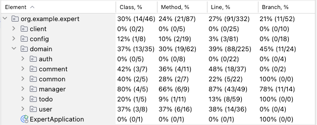

# SPRING ADVANCED

## 요구사항

- [x] Lv1 Early Return(Auth Service)
- [x] Lv1 Weather Client if - else 리팩토링
- [x] Lv1 UserService changePassword -> DTO Validation
- [x] Lv2 TodoService getTodos EntityGraph N + 1 문제 개선
- [x] Lv3 PassEncoderTest 성공 할 수 있도록 수정
- [x] Lv3 ManagerService 테스트 수정
- [x] Lv3 CommentServiceTest 수정
- [x] Lv3 ManagerService 테스트 통과하도록 서비스 로직 수정
- [x] Lv4 API 로깅 추가 AOP
- [x] Lv5 코드 문제점 개선 -> 테스트 케이스 보강
- [x] Lv6 인텔리제이 테스트 커버리지 측정 확인

## 커버리지 확인

